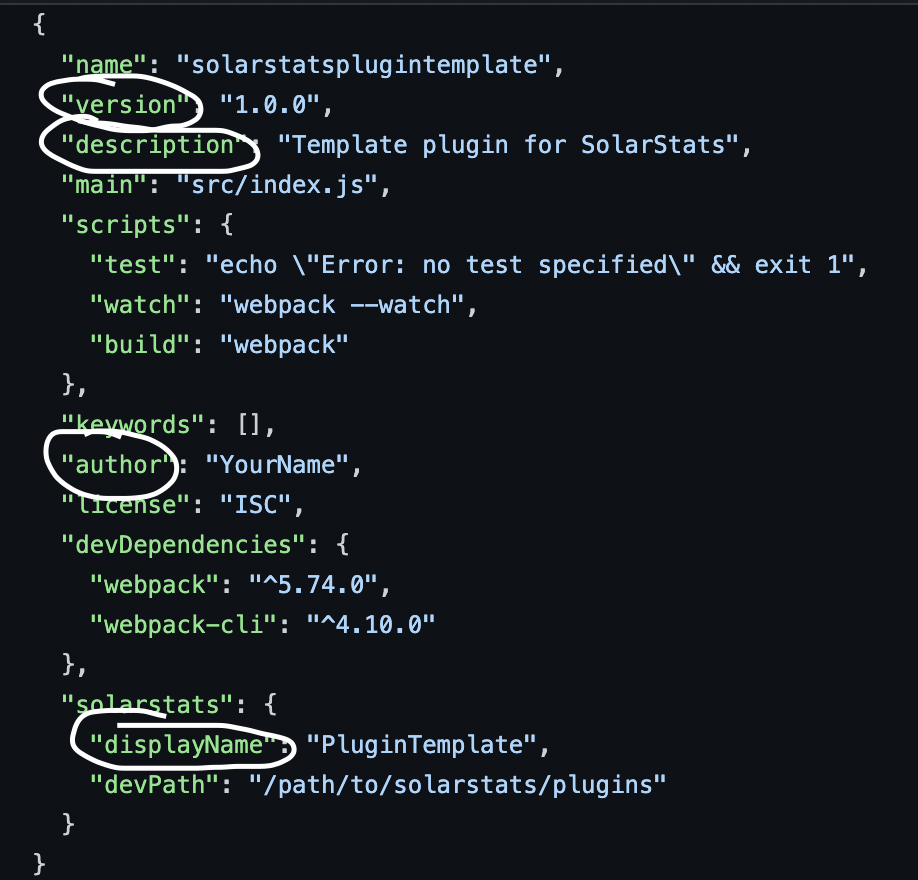

# Start Creating

To start making your plugin, go to the `package.json` file and take a look.

To change the name of your plugin, find the `solarstats` object, and change the `displayName`

To change the description, author, or version of your plugin, go to the respective values inside the file and change them.



!> **DON'T CHANGE ANYTHING ELSE** You should only need to change the files in the **src** folder now

Open up the `src` folder and go to `index.js`.

You should see:

```javascript
registerPlugin({
	name: __package.name,
	description: __package.description,
	version: __package.version,
	author: __package.author
});
```

This is what registers your plugin.

Now, you can add any files inside the `src` folder, and you can import them as you wish.

You can also install any npm packages with `npm install` and webpack will auto compress them when you build it.

> You can build your plugin by running `npm run build` (recommended) or `webpack`

<br/>

#### Now you can navigate to any other pages on the sidebar for more info <!-- {docsify-ignore} -->
